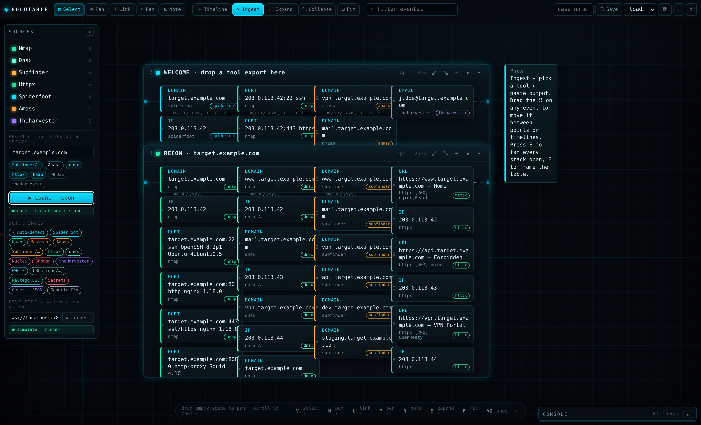

# OSINT Holotable

A free-floating, **MS-Paint-style intel table** for OSINT work. Lay out as many
timelines as you want across an infinite canvas; each point on a timeline holds a
**stack of overlapping, semi-transparent event boxes** that you can fan open with
a single command. Ingest output from **many tools — not just SpiderFoot** — and
pipe a live CLI scan straight onto the table as it runs.

It is one folder of static files. **No build, no server, no network calls.** Open
`index.html` from `file://` and it works on a disconnected forensic box.



---

## The idea

> *"…kinda like Iron Man in the Avengers, where he can plot in 3D in his living
> room and work through a complex scene. Multiple timelines, free-floating, almost
> like MS Paint where you can use your whole screen. Multiple OSINT tools, CLI
> based, so you can take the information from there — almost like a pipe into a VNC."*

That's the brief. Concretely:

- **The table is the whole screen.** Pan by dragging empty space, zoom with the
  wheel. A holographic grid gives you spatial reference. Drop timelines and notes
  anywhere.
- **Timelines stack events.** Every event sharing a time-bucket collapses into one
  receding, translucent stack with a count badge. Click a point — or hit **`E`** —
  to fan them all open into a readable column.
- **Everything is writeable.** Edit any event's type / data / module inline, edit a
  point's timestamp, rename timelines. Add and delete points, boxes, timelines.
- **Drag-and-drop works freely.** Grab an event by its `⠿` grip and drop it on any
  point — on the same timeline or a different one. While you drag, every point lights
  up a translucent drop-zone.
- **Pipe in any tool.** Parsers for SpiderFoot, Nmap, theHarvester, Amass, Shodan,
  Recon-ng, WHOIS, DNSRecon, plus generic CSV/JSON/raw-lines. Paste, drop a file, or
  stream a live scan over a local WebSocket bridge.

---

## Run it

```bash
git clone <this repo>
cd auto-osintssh
# just open the file — no server needed
xdg-open index.html        # Linux
open index.html            # macOS
```

Or double-click `index.html`. It runs entirely in the browser; nothing is uploaded.
Your board autosaves to the browser's local storage, and you can **Export** a
portable `.json` case file to move between machines or commit to a repo.

---

## Ingesting tool output

Click **Ingest** (or press **`I`**), pick the tool (or leave it on **⚡ Auto-detect**),
paste its output (or drop the file), choose a grouping granularity, and choose a target
timeline (or a new one). Sample exports for every parser live in [`samples/`](samples/).

**Auto-detect** sniffs the format from the content and filename, so usually you can just
paste and go — the preview tells you what it detected.

| Tool | Accepts |
|------|---------|
| **SpiderFoot** | CSV export (`Updated, Type, Module, Source, Data` — tolerant of column order/names) |
| **Nmap / Masscan** | normal, greppable (`-oG`), XML / list / JSON — open ports → events, hostnames + IPs split out |
| **Subfinder / Amass / assetfinder / sublist3r** | subdomain lists or JSON; Amass `name --> record --> ip` relations |
| **httpx** | JSONL or text (`url [status] [title] [tech]`) — URL + host + status/tech |
| **dnsx** | `host [A] [ip]` text or JSONL — domains and resolved records |
| **Nuclei** | JSONL or text findings — severity becomes the event type, template id the module |
| **theHarvester** | JSON or the plain-text `[*] … found:` report |
| **Shodan / Censys** | host/search JSON (→ `ip:port` services) or `shodan host` text |
| **WHOIS** | raw `key: value` text (registrar, creation/expiry dates timed automatically) |
| **URLs (gau / waybackurls / katana)** | one URL per line |
| **Secrets (gitleaks / trufflehog)** | JSON findings → `secret` events |
| **Recon-ng / DNSRecon / Maltego** | CSV / JSON exports |
| **Generic CSV / JSON / Raw lines** | anything else — values are auto-classified (ip, email, domain, url, hash, CVE…) |

Header row count doesn't match what you expected? Paste your exact header row and the
column aliases can be widened — see `headerIndex()` in `app.js`.

Events are colour-coded by source. The **dock legend** lets you toggle any source's
visibility; **search** (top bar) dims everything that doesn't match.

### Export — for other tools & reports

**Export ⤓** offers four formats, so the board feeds back into your pipeline:

- **Board (.json)** — the full editable board (re-import with **⤒**).
- **Events (.csv)** — one row per event (`timeline, timestamp, type, module, data, source`) for grep / spreadsheets / SIEM.
- **Maltego (.csv)** — entity-typed rows (`maltego.IPv4Address`, `maltego.Domain`, …) ready for Maltego's CSV import.
- **Report (.md)** — a Markdown brief grouped by timeline, with a source summary and the links you drew.

---

## Recon runner — launch scans from the table

`bridge/pipe-server.js` is a **zero-dependency** Node orchestrator. The table can
hand it a job — a target plus a set of tools — and it runs each tool and streams the
results back over a WebSocket, live. This is the "pipe into a VNC": pick a target,
pick tools, watch the board fill.

```bash
node bridge/pipe-server.js                 # SIMULATE (safe) — runs nothing real
node bridge/pipe-server.js --exec          # run real LOCAL tools
node bridge/pipe-server.js --ssh user@recon-box   # run the tools over SSH
node bridge/pipe-server.js --demo          # passive synthetic feed (no jobs)
```

Then in the page: **dock ▸ RECON ▸ type a target ▸ tick tools ▸ Launch**. A
`RECON · <target>` timeline appears and fills as each tool reports; raw lines scroll
in the console. (Or **dock ▸ LIVE PIPE ▸ connect** to just watch a stream.)

Built-in tools: `subfinder`, `amass`, `dnsx`, `httpx`, `nmap`, `theharvester`, `whois`,
`dnsrecon`, `host` — each mapped to its matching parser. `node bridge/pipe-server.js --list-tools`
prints the registry.

### Flags

| flag | what it does |
|------|--------------|
| `--exec` / `--ssh user@host` | run real tools locally / over SSH (default is simulate) |
| `--scope FILE` | allowlist — only targets matching a domain, `*.domain`, or CIDR run ([`samples/scope.txt`](samples/scope.txt)) |
| `--config FILE` | add custom tools without touching code ([`bridge/tools.example.json`](bridge/tools.example.json)) |
| `--concurrency N` | run up to N tools at once (default 1) |
| `--timeout SEC` | kill any tool after SEC seconds |
| `--out DIR` | save each tool's raw output to `DIR/<target>-<tool>.txt` |
| `--port N` / `--host H` | bind address (default `127.0.0.1:7842`) |
| `--list-tools` | print the registry and exit |

Custom tools use a `{target}` placeholder that's substituted as a **single argv element**
(never a shell string), so the no-injection guarantee holds for them too:

```json
{ "katana": { "bin": "katana", "args": ["-u", "{target}", "-silent"], "tag": "urls" } }
```

```bash
node bridge/pipe-server.js --exec --scope samples/scope.txt \
     --config bridge/tools.example.json --concurrency 3 --timeout 120 --out ./loot
```

### Safety model

This is dual-use tooling — the safety rails are deliberate, for **authorized
engagements only**:

- **Simulate by default.** With no flags the runner executes *nothing* real; it emits
  realistic synthetic output so the whole pipeline is demonstrable offline. Real
  execution is an explicit opt-in (`--exec` / `--ssh`).
- **The page can't run shell.** It can only ask to run tools from a fixed registry
  against a target. There is no path from the page to an arbitrary command.
- **Targets are validated** (domain / IP / CIDR) and every tool runs via `spawn()`
  with an **argv array — no shell** — so a target can never inject a command. A target
  like `evil.com; rm -rf /` is rejected outright.
- **`--scope` keeps you in bounds** — with an allowlist file, anything outside your
  authorized domains / CIDRs is refused before a tool ever runs.
- Binds to **127.0.0.1** by default.

The legacy one-shot stream mode is still available for power users:
`node bridge/pipe-server.js --tool nmap -- nmap -sV target.example.com`.

---

## Controls

| | |
|---|---|
| **Pan** | drag empty space · hold **Space** · **`H`** mode |
| **Zoom** | mouse wheel (zooms to cursor) · **`F`** frames everything |
| **Select / edit** | **`V`** — click a box to select, click its text to edit |
| **Move event** | drag the `⠿` grip onto any point (any timeline) |
| **Expand / collapse** | click a point · per-timeline `⤢`/`⤡` · all: **`E`** / **`C`** |
| **Link events** | **`L`**, click two boxes (double-click a link to remove) |
| **Pen / Note** | **`P`** free-draw · **`N`** drop a sticky note |
| **New timeline** | **`T`** or the toolbar |
| **Recon** | dock ▸ RECON ▸ target + tools ▸ Launch (drives the runner) |
| **Undo / redo** | **⌘/Ctrl-Z** · **⌘/Ctrl-Shift-Z** |
| **Delete** | select + **Delete** · per-item `✕` |
| **Right-click** | context menu on events / timelines / canvas |

Saves live in the top-right: name a case, **Save**, then **Load**/**Delete** from the
dropdown. **Export ⤓** / **Import ⤒** move portable `.json` boards.

---

## Architecture

One folder, three core files, no framework:

```
index.html              # shell / DOM skeleton
styles.css              # the holographic OSINT theme
app.js                  # engine: camera, render, interaction, parsers, pipe, saves
bridge/pipe-server.js   # zero-dependency recon runner + WebSocket bridge
samples/                # one realistic export per supported tool
test/test.js            # pure-helper unit tests (parsers, time, layout)
test/runner.test.cjs    # runner unit tests (validation, argv, frame codec, sim↔parser)
test/smoke.cjs          # headless-browser smoke test (UI flows)
test/recon.cjs          # runner ↔ page integration test
```

- The **camera** is a `{x, y, zoom}` transform on a `#world` div; the grid is drawn on
  a viewport-fixed canvas from the same camera, so they stay in lockstep.
- **Timelines and notes** are absolutely-positioned DOM (cheap inline editing); **links
  and pen strokes** render on an SVG layer in world space so they pan/zoom together.
- Parsers, time/bucketing and point-layout are **pure functions**, exported for Node
  tests. All ingested data is rendered via `textContent` (never `innerHTML`), so a
  malicious value in a target's data can't inject markup.
- `window.holotable` is a small scripting handle — `push()`, `ingestText()`, `setCam()`,
  `fit()` — for driving the table programmatically.

### Tests

```bash
npm test                                     # 77 parser + 54 runner unit checks (zero deps)
NODE_PATH=$(npm root -g) npm run test:smoke  # headless-browser smoke test  (needs playwright)
NODE_PATH=$(npm root -g) npm run test:recon  # runner ↔ page integration   (needs playwright)
```

`npm test` covers the parsers (CSV edge cases, header reordering, every tool format,
auto-detection), time round-trips, bucketing, layout, **and** the runner (target
validation incl. injection attempts, scope/CIDR matching, flag parsing, no-shell argv
building, the WebSocket frame codec, and a contract check that every simulator's output
parses cleanly through the matching page parser).
The browser tests load the real page: `smoke` exercises boot, ingest, free-drag,
linking, notes, search, zoom, save and undo; `recon` spawns the runner and drives a
full job through the RECON panel, asserting results flow back and a malicious target is
rejected.

---

## Notes & roadmap

- **"Wrap-around" scroll** from an earlier iteration is superseded by free pan/zoom —
  the whole table is now the scroll surface, so timelines never run out of room.
- **Granularity is applied at ingest time** (per import), deliberately, so it never
  re-buckets and fights your manual point/timestamp edits afterward.
- The recon runner already executes tools **locally or over SSH** (`--ssh user@host`)
  and streams results back. Next seams: per-timeline time-proportional spacing as a
  toggle; multi-select drag; parallel tool execution.

Authorized / defensive use only — for your own engagements, CTFs, and research.
